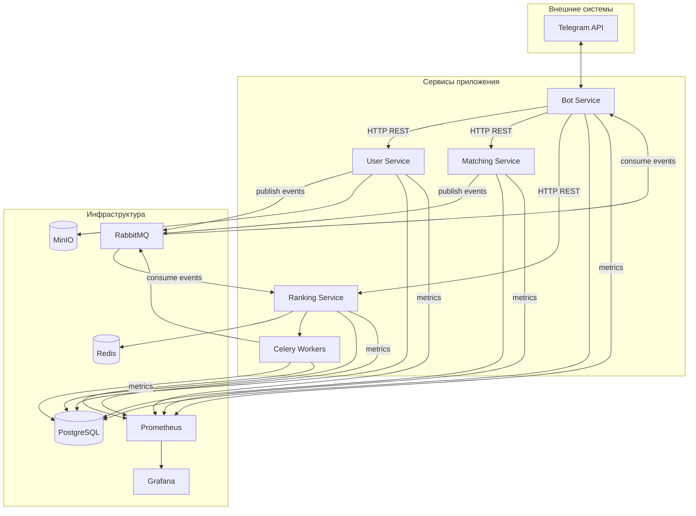

# Диаграмма компонентов (Component Diagram)

Высокоуровневое представление сервисов, инфраструктуры и связей между ними.

## Легенда

| Тип связи | Описание |
|-----------|----------|
| HTTP REST | Синхронные запросы (профили, свайпы, лента) |
| MQ events | Асинхронные события (`match.created`, `profile.updated`, `swipe.created`) |
| metrics | Экспорт метрик для Prometheus |
