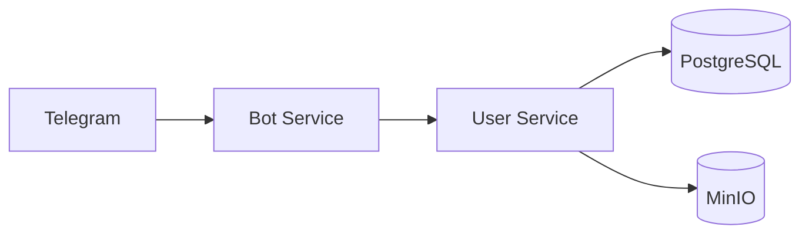
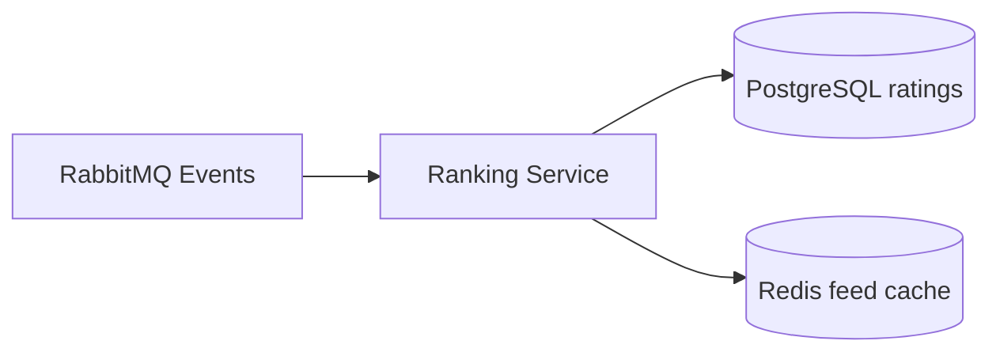
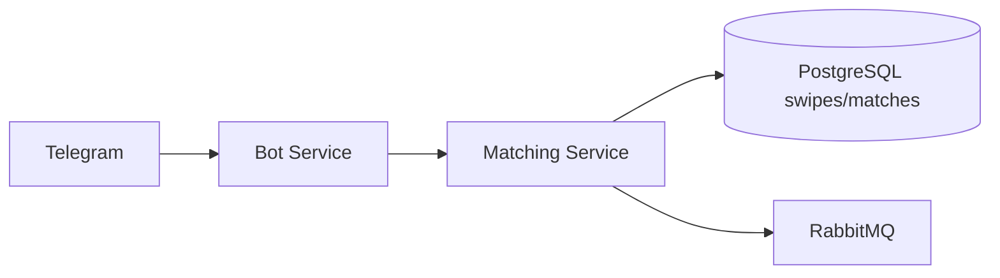
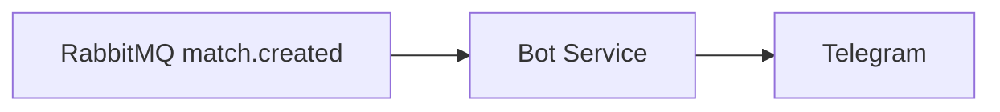
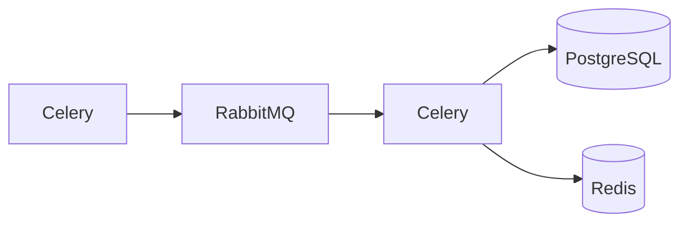

# Диаграмма потоков данных (Data Flow Diagram)

Как данные проходят через систему от ввода пользователем до сохранения в БД, кэширования и доставки другим пользователям.

## Поток анкеты

Пользователь вводит данные в Telegram. Бот собирает их и отправляет в User Service. User Service сохраняет профиль в PostgreSQL и фото в MinIO.

## Поток рейтинга

## Поток свайпа

Пользователь ставит лайк или пропуск в Telegram. Бот передаёт в Matching Service. Matching Service записывает в PostgreSQL и публикует события в MQ.

## Поток уведомлений

## Поток фоновых задач

Celery по расписанию отправляет задачи в RabbitMQ. Он же выполняет пересчёт рейтингов, предзагрузку ленты, записывает в PostgreSQL и Redis.
