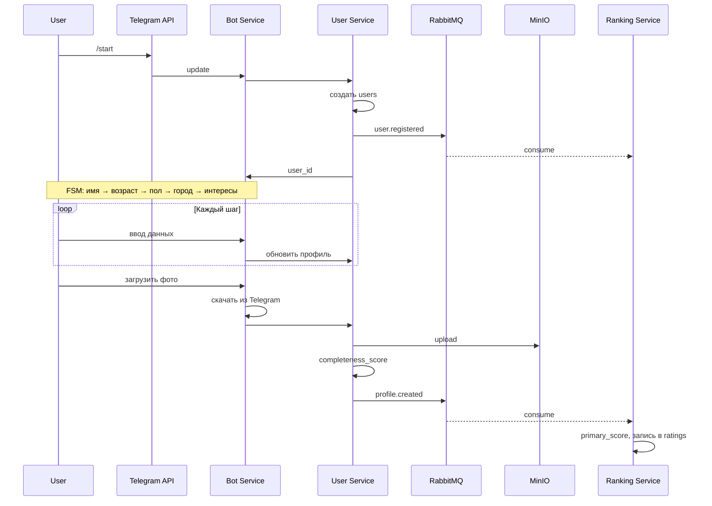

# Диаграмма последовательности: Регистрация и создание анкеты

Пошаговый поток от команды `/start` до полностью созданной анкеты с фото.

```mermaid
sequenceDiagram
    participant U as User
    participant TG as Telegram API
    participant BOT as Bot Service
    participant USER as User Service
    participant MQ as RabbitMQ
    participant MINIO as MinIO
    participant RANK as Ranking Service

    U->>TG: /start
    TG->>BOT: update

    BOT->>USER:
    USER->>USER: создать users
    USER->>MQ: user.registered
    MQ-->>RANK: consume
    USER->>BOT: user_id

    Note over BOT,U: FSM: имя → возраст → пол → город → интересы

    loop Каждый шаг
        U->>BOT: ввод данных
        BOT->>USER: обновить профиль
    end

    U->>BOT: загрузить фото
    BOT->>BOT: скачать из Telegram
    BOT->>USER: 
    USER->>MINIO: upload
    USER->>USER: completeness_score
    USER->>MQ: profile.created
    MQ-->>RANK: consume
    RANK->>RANK: primary_score, запись в ratings
```
