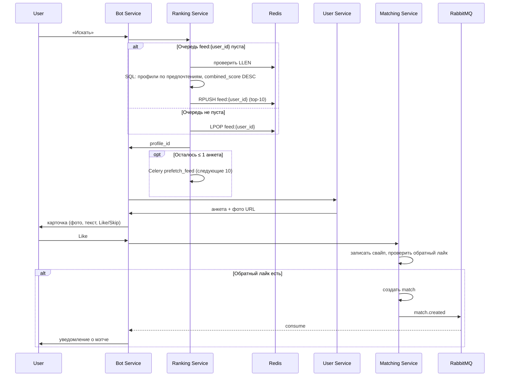

# Диаграмма последовательности: Просмотр анкет и свайп

Поток от запроса ленты до момента мэтча.

```mermaid
sequenceDiagram
    participant U as User
    participant BOT as Bot Service
    participant RANK as Ranking Service
    participant REDIS as Redis
    participant USER as User Service
    participant MATCH as Matching Service
    participant MQ as RabbitMQ

    U->>BOT: «Искать»
    BOT->>RANK:

    alt Очередь feed:{user_id} пуста
        RANK->>REDIS: проверить LLEN
        RANK->>RANK: SQL: профили по предпочтениям, combined_score DESC
        RANK->>REDIS: RPUSH feed:{user_id} (top-10)
    else Очередь не пуста
        RANK->>REDIS: LPOP feed:{user_id}
    end

    RANK->>BOT: profile_id

    opt Осталось ≤ 1 анкета
        RANK->>RANK: Celery prefetch_feed (следующие 10)
    end

    BOT->>USER: 
    USER->>BOT: анкета + фото URL
    BOT->>U: карточка (фото, текст, Like/Skip)

    U->>BOT: Like
    BOT->>MATCH:
    MATCH->>MATCH: записать свайп, проверить обратный лайк

    alt Обратный лайк есть
        MATCH->>MATCH: создать match
        MATCH->>MQ: match.created
        MQ-->>BOT: consume
        BOT->>U: уведомление о мэтче
    end
```
