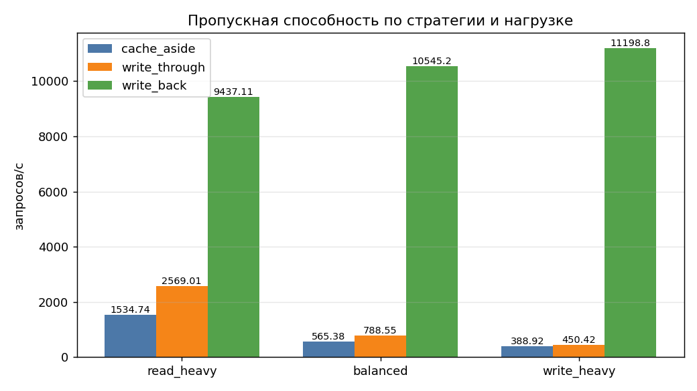
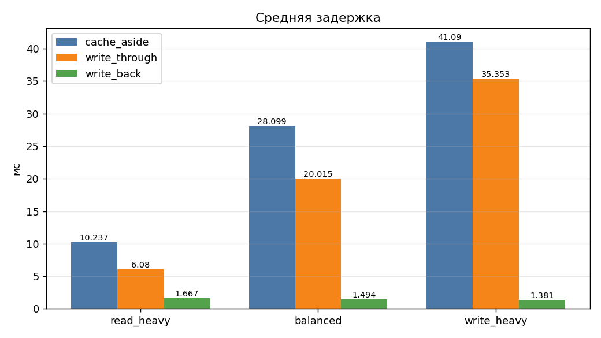
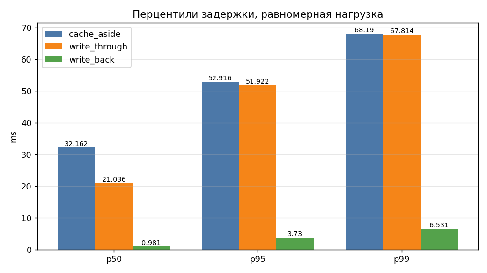
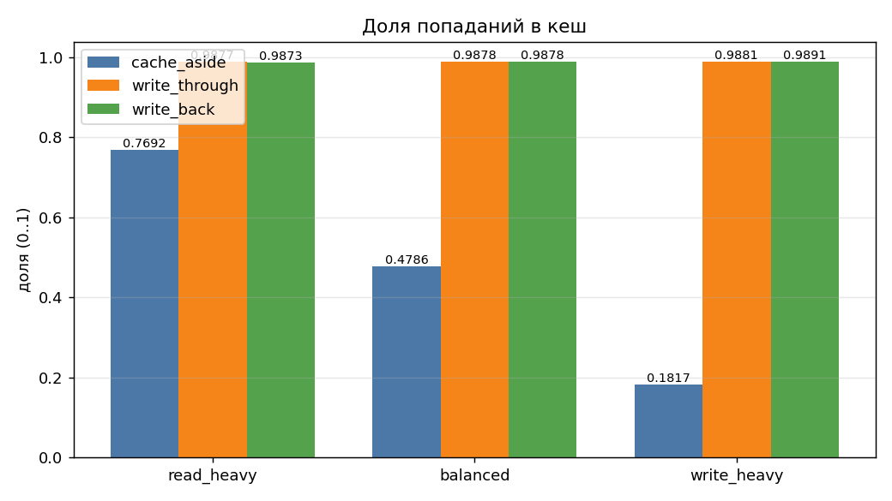
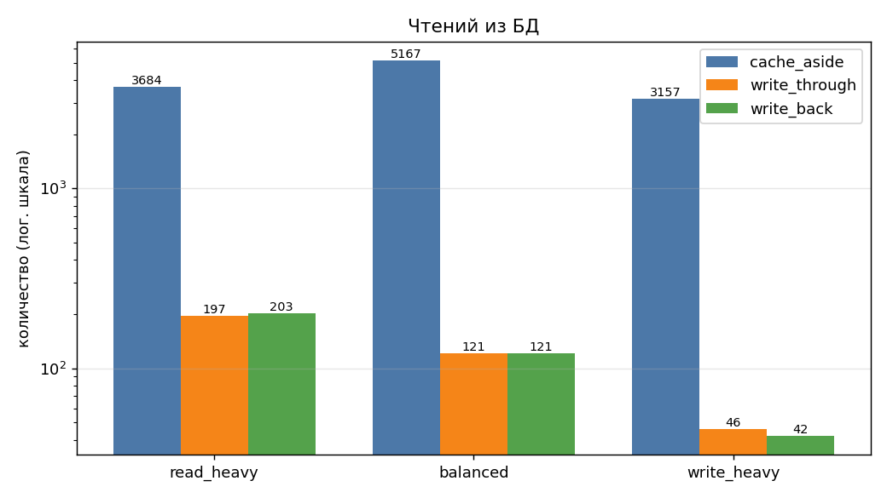
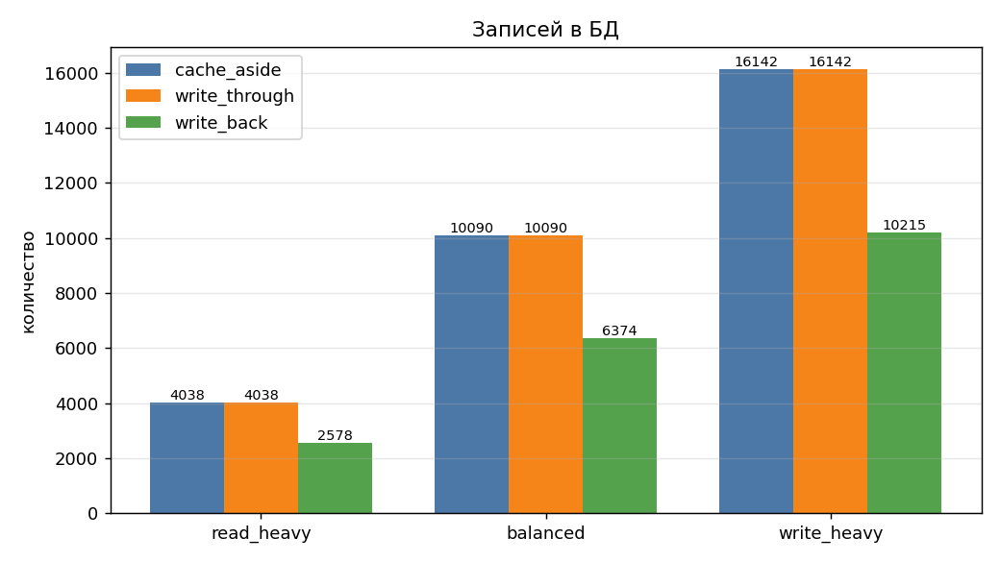
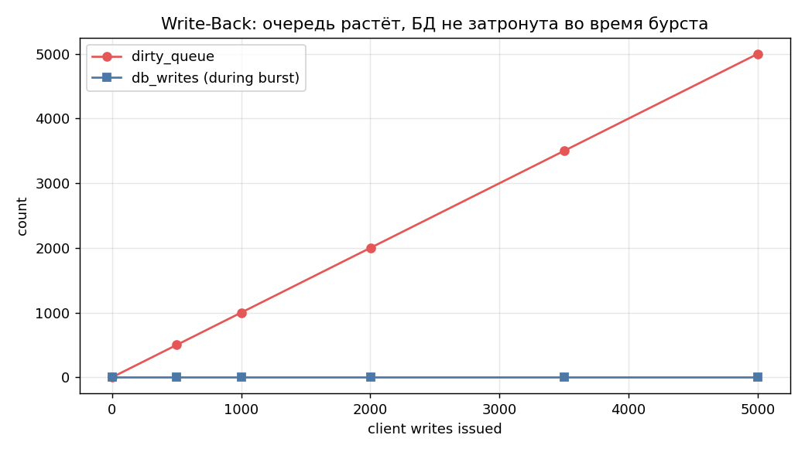

# Сравнение типов кеширования

## Запуск

```bash
docker compose down -v && docker compose up --build
```

После прогона JSON и Markdown с результатами лежат в [results/](results/).

### Реализации стратегий

- `CacheAside`. Чтение: смотрим в кеш, на пропуск идём в БД и кладём результат в кеш. Запись: пишем в БД и инвалидируем ключ в кеше (запись в обход: следующее чтение перечитает свежее значение из БД).
- `WriteThrough`. Чтение: то же. Запись: синхронно пишем и в БД, и в кеш.
- `WriteBack`. Чтение: то же. Запись: пишем только в кеш и кладём запись в очередь отложенных. Фоновый поток раз в `flushInterval` секунд берёт пакет до `batchSize` записей, схлопывает повторы по `id` (одна финальная версия на ключ) и сохраняет одной транзакцией. Перед финальным сбросом фоновый поток останавливается, пакеты сортируются по `profileId`, чтобы одинаковый порядок захвата блокировок строк исключал взаимные блокировки.

---

## Параметры тестов

Параметры одинаковые для всех трёх стратегий и всех трёх нагрузок:

| Параметр | Значение |
|---|---|
| Всего операций | 20 000 |
| Конкурентность | 16 потоков |
| Ключевое пространство | 200 идентификаторов |
| Seed генератора | 47 |

Профили нагрузки:

| Профиль | чтение | запись |
|---|---|---|
| `read_heavy` | 80% | 20% |
| `balanced` | 50% | 50% |
| `write_heavy` | 20% | 80% |

Перед каждым прогоном таблица `profiles` обнуляется и заново наполняется (1000 записей), кеш сбрасывается через `FLUSHDB`. Счётчики стратегии обнуляются явно, чтобы операции инициализации не попадали в метрики.

---

## Метрики

Собраны все четыре требуемые метрики:

- `throughput_rps` - пропускная способность в запросах/с за прогон.
- `avg_latency_ms` - средняя задержка одной операции (плюс перцентили п50/п95/п99).
- `db_reads`, `db_writes` - фактическое число обращений в БД, измерено счётчиками внутри приложения.
- `cache_hit_rate` - доля попаданий: `попадания / (попадания + пропуски)`.

---

## Результаты

Цифры из [results/results.json](results/results.json).

### Нагрузка 80% / 20% (на чтение)

| Стратегия | зап/с | ср_мс | п95_мс | п99_мс | чт_бд | зап_бд | попадания | пропуски | доля_попад |
|---|---|---|---|---|---|---|---|---|---|
| cache_aside   | 1534.74 | 10.237 | 35.702 | 44.855 | 3 684 | 4 038 | 12 278 | 3 684 | 0.7692 |
| write_through | 2569.01 |  6.080 | 33.531 | 46.672 |   197 | 4 038 | 15 765 |   197 | 0.9877 |
| write_back    | 9437.11 |  1.667 |  4.038 | 10.544 |   203 | 2 578 | 15 759 |   203 | 0.9873 |

Ожидало сброса в БД (Write-Back): 3 438 записей, сброшены за 0.126.

### 50% / 50%

| Стратегия | зап/с | ср_мс | п95_мс | п99_мс | чт_бд | зап_бд | попадания | пропуски | доля_попад |
|---|---|---|---|---|---|---|---|---|---|
| cache_aside   |  565.38 | 28.099 | 52.916 | 68.190 | 5 167 | 10 090 | 4 743 | 5 167 | 0.4786 |
| write_through |  788.55 | 20.015 | 51.922 | 67.814 |   121 | 10 090 | 9 789 |   121 | 0.9878 |
| write_back    | 10545.22 |  1.494 |  3.730 |  6.531 |   121 |  6 374 | 9 789 |   121 | 0.9878 |

Ожидало сброса (Write-Back): 9 490 записей, сброс очереди занял 0.468 с.

### Нагрузка 20% / 80% (на запись)

| Стратегия | зап/с | ср_мс | п95_мс | п99_мс | чт_бд | зап_бд | попадания | пропуски | доля_попад |
|---|---|---|---|---|---|---|---|---|---|
| cache_aside   |  388.92 | 41.090 | 65.064 | 82.342 | 3 157 | 16 142 |   701 | 3 157 | 0.1817 |
| write_through |  450.42 | 35.353 | 63.612 | 81.488 |    46 | 16 142 | 3 812 |    46 | 0.9881 |
| write_back    | 11198.76 |  1.381 |  3.636 |  5.731 |    42 | 10 215 | 3 816 |    42 | 0.9891 |

Ожидало сброса (Write-Back): 15 742 записи, сброс очереди занял 0.804 с.

---

## Демонстрация накопления записей в Write-Back

Отдельный сценарий с увеличенным `flushInterval = 5 с` и `batchSize = 500`. Всплеск из 5 000 синхронных записей в один поток, ключевое пространство 200.

Из [results/results.json](results/results.json), секция `write_back_accumulation`:

| После N записей | Прошло, с | Очередь отложенных | Записей в БД |
|---|---|---|---|
| 1     | 0.0001 |    1 | 0 |
| 501   | 0.0177 |  501 | 0 |
| 1 001 | 0.0351 | 1001 | 0 |
| 2 001 | 0.0673 | 2001 | 0 |
| 3 501 | 0.1159 | 3501 | 0 |
| 5 000 | 0.1656 | 5000 | 0 |

```json
"burst_writes": 5000,
"burst_duration_s": 0.1656,
"burst_throughput_rps": 30189.67,
"dirty_before_final_drain": 5000,
"drain_duration_s": 0.1181,
"final_db_writes": 2000
```

Что видно:

1. Все 5 000 клиентских записей выполнились за 0.17 с (~30 190 оп/с). Это пиковая характеристика чисто кеш-операций без участия БД.
2. На момент окончания всплеска в БД ушло **0** записей - фоновый поток ещё спит до следующего интервала.
3. Финальный сброс за 0.118 с схлопнул 5 000 ожидающих записей в **2 000** уникальных строк (200 ключей * ~10 повторов каждый - схлопывание работает только внутри пакета, поэтому реальный коэффициент сжатия меньше теоретического).
4. Если приложение упадёт между п. 2 и п. 3 - все 5 000 записей теряются. Это и есть основной риск Write-Back.

---

## Графики

### Пропускная способность



Write-Back доминирует на всех профилях. При нагрузке с преобладанием записи разница достигает 25x против Write-Through и 29x против Cache-Aside. Cache-Aside и Write-Through идут близко, потому что обе платят за синхронный `INSERT/UPDATE` в БД.

### Средняя задержка



Cache-Aside - самый медленный во всех профилях, особенно при преобладании записи (41 мс в среднем). Write-Back держит ~1.5 мс независимо от профиля, потому что клиент пишет только в Redis.

### Перцентили задержки на равномерной нагрузке



п99 у Cache-Aside и Write-Through сопоставим (~68 мс) - хвост распределения определяется операциями с БД. У Write-Back п99 = 6.5 мс, на порядок ниже.

### Доля попаданий



Write-Through и Write-Back держат ~0.99 на любых профилях. Cache-Aside проседает до 0.18 при преобладании записи: каждая запись инвалидирует ключ.

### Обращения в БД на чтение

 (логарифмическая ось Y)

Cache-Aside делает на два порядка больше обращений в БД на чтение, чем стратегии с прогревом кеша.

### Обращения в БД на запись



Cache-Aside и Write-Through идентичны (синхронная запись в БД при каждой операции). Write-Back за счёт схлопывания экономит: 2578 / 6374 / 10215 против 4038 / 10090 / 16142.

### Накопление записей в Write-Back



5 000 клиентских записей за 0.17 с, фоновый поток не успел сработать ни разу (`flushInterval = 5 с`). В БД ушло **0** записей. Это и есть окно потери данных при сбое.

---

## Выводы

### Лучше для чтения

**Write-Through** и **Write-Back** почти одинаковы по доле попаданий (0.987–0.988): обе стратегии прогревают кеш на каждой записи, поэтому пропусков почти нет.
**Cache-Aside** проигрывает: доля попаданий 0.77 при преобладании чтения и 0.48 на равномерной нагрузке, потому что каждая запись инвалидирует ключ и следующее чтение обязано сходить в БД (3 684 обращения против 197 у Write-Through). При преобладании чтения Write-Through даёт 2 569 зап/с против 1 535 у Cache-Aside при одинаковом числе обращений в БД на запись, а Write-Back 9 437 зап/с за счёт того, что записи не блокируют клиента. Для чтения побеждает любая стратегия с прогревом, причём Write-Back быстрее всех.

### Лучше для записи

**Write-Back** доминирует с большим отрывом. При преобладании записи: **11 199 зап/с** против 450 у Write-Through и 389 у Cache-Aside - разница в 25–29 раз. Клиент платит только за `SET` в Redis, а не за `INSERT/UPDATE` в PostgreSQL, плюс пакетная обработка и схлопывание в фоне физически уменьшают число записей в БД: 10 215 фактических обращений против 16 142 у двух других стратегий. Цена - отложенная согласованность и риск потери данных из очереди при сбое (на момент конца нагрузки висело 15 742 ожидающих записи).  
**Write-Through** даёт строгую согласованность и высокую долю попаданий для последующих чтений, но при преобладании записи выигрывает у Cache-Aside всего на ~16% по пропускной способности.  
**Cache-Aside** при преобладании записи - самый плохой вариант: доля попаданий падает до 0.18, и почти каждое чтение всё равно идёт в БД. Для записи побеждает Write-Back, при условии что потеря последних записей в очереди допустима.

### Лучше для смешанной нагрузки

На равномерной нагрузке **Write-Back** даёт 10 545 зап/с против 789 у Write-Through и 565 у Cache-Aside - разница в 13–19 раз. Если требования по согласованности позволяют, выбор очевиден. Если данные критичны и терять их нельзя - берём **Write-Through**: доля попаданий та же (0.988), средняя задержка 20 мс против 28 мс у Cache-Aside, число обращений в БД на чтение в 43 раза меньше. **Cache-Aside** имеет смысл только когда объём записей мал, ключевое пространство огромное и прогревать кеш заранее дорого: инвалидация при записи в обход защищает от вытеснения горячих ключей, но в данном тесте давала минусы во всех сценариях.

### Сводная таблица по сценариям

| Критерий | Выбор | Почему |
|---|---|---|
| Чтение | Write-Back / Write-Through | доля попаданий 0.99 + запись не блокирует клиента |
| Запись | Write-Back | запись только в Redis, схлопывание пакетов в фоне |
| Смешанная | Write-Back / Write-Through | пропускная способность в 13–19* выше при той же доле попаданий; Write-Through если важна согласованность |
| Согласованность критична | Write-Through | синхронная запись в обе системы |
| Ключевое пространство огромное и кеш мал | Cache-Aside | не тратим память на ключи, которые не читают |
